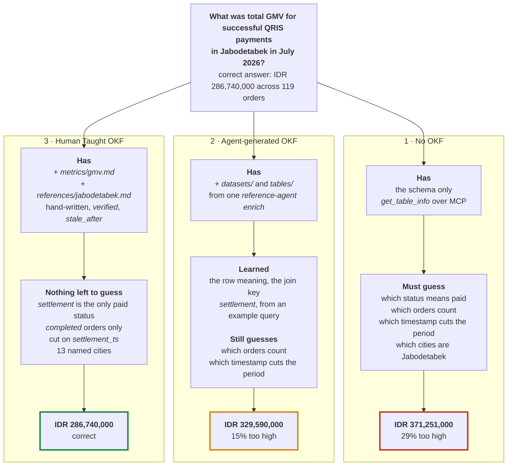

# okf-bigquery-adk

This repository is and implementation example on how business domain knowledge can be documented to enrich AI agent knowledge using Open Knowledge Format. An ADK agent that answers business questions about a marketplace which fetch numbers from BigQuery. Business rules come from Markdown files in this repository, in Open Knowledge Format (OKF).

A schema can tells an agent which columns exist and a certain level of description, however it does not tell it what the business decided. This repository shows a mechanism to measures that gap and then giving an example approach on how to solve it.

Terms used throughout: 
- **GMV** is Gross Merchandise Value, the total value of goods sold in a period. 
- **QRIS** is Indonesia's national QR payment standard. 
- **Jabodetabek** is the Jakarta metropolitan area: Jakarta, Bogor, Depok, Tangerang, Bekasi. 
- The **reference agent** is Google's tool from [OKF specs repository](https://github.com/GoogleCloudPlatform/open-knowledge-format/tree/main/src/reference_agent),that writes initial OKF files from BigQuery metadata. It authors bundles but it might still missing important information which still need our intervention on it.

## What this shows

Let's take a business use case where we have a marketplace data (`orders` and `payment`) and we want to have an answer of the following question

> What was total GMV for successful QRIS payments in Jabodetabek in July 2026?

Our agent is already connected to the data on BigQuery, but now can we expect an accurate result obtained from it?

In this repo, we provide an experimentation on this in 3 scenarios: 
- `No OKF` 
- `Agent-generated only OKF` - OKF in `bundles/generated` by invoking the [reference-agent](https://github.com/GoogleCloudPlatform/open-knowledge-format/tree/main/src/reference_agent) pointing to our Bigquery dataset
- `Human Taught OKF` - OKF in `bundles/marketplace`




From the experimentation we can see that agents answer can cuts the error from 29% to 15%. The [reference-agent](https://github.com/GoogleCloudPlatform/open-knowledge-format/tree/main/src/reference_agent) generated OKF does most of the work on accuracy. But it is not enough.

What it cannot do is settle the question. Without OKF the agent gave three different headline numbers in four runs. With the generated bundle the headline held at 329.6M, but two runs of four also offered 328.6M, because no file says which timestamp cuts the period. The agent knew that it did not know. Only the hand-written files remove the question.

That is the difference between context and knowledge. Context is raw material that the agent reasons over again in every session. Knowledge is a conclusion that a person already reached and signed off.

The generated bundle is not wrong because the model is weak. It filters on `transaction_status = 'settlement'` correctly and expands Jabodetabek into all 13 cities unaided. It is wrong about what `INFORMATION_SCHEMA` cannot hold: it might cuts the period on `order_ts` instead of `settlement_ts`, and it counts orders the customer returned. 15% off, on a number someone puts in a board report. This shows a gaps where we should teach the agent to do proper data analysis with the business knowledge the analytics team has and OKF provide a standardized templates on how to do this

We can utilize the `reference-agent enrich` command to initialize the OKF bundles with the data schema we have, then iteratively add knowledge on what and how to do things properly

## What you need

| Requirement | Version | Note |
|---|---|---|
| Python | 3.11 or later | We used 3.13. The reference agent also needs 3.11 or later. |
| [uv](https://docs.astral.sh/uv/) | any recent | `pip` also works. Read [pyproject.toml](pyproject.toml) for the list of packages. |
| `google-adk` | pinned to `2.8.0`, with the `[mcp]` extra | Plain `google-adk` has no MCP support and fails with a confusing `ImportError`. Read [Failure modes](#failure-modes). |
| `gcloud` and `bq` | any recent | For login and for loading the data. |
| Google Cloud project | — | Enable the BigQuery API. That step alone turns on the BigQuery MCP server. |
| IAM roles | — | `roles/mcp.toolUser`, `roles/bigquery.jobUser`, `roles/bigquery.dataViewer` |

## Setup

```bash
git clone <this repo> && cd okf-bigquery-adk
cp .env.example .env
# set GOOGLE_CLOUD_PROJECT in .env                          
gcloud auth application-default login
uv sync
```

That one login covers the model and the BigQuery MCP server. To use a Gemini API key for the model instead, see `.env.example`. You still need Application Default Credentials for BigQuery.

## Run

```bash
export PROJECT=$(grep GOOGLE_CLOUD_PROJECT .env | cut -d= -f2)

# 1. Create the dataset and tables.
bq --project_id=$PROJECT query --use_legacy_sql=false < seed/schema.sql

# 2. Load 2,000 rows.
bq --project_id=$PROJECT query --use_legacy_sql=false < seed/seed_data.sql

# 3. Every row must read PASS.
bq --project_id=$PROJECT query --use_legacy_sql=false < seed/verify.sql

# 4. Ask the same question against each bundle.
OKF_BUNDLE=bundles/generated   uv run adk run agent
OKF_BUNDLE=bundles/marketplace uv run adk run agent
```

Two more questions, with their correct answers, are in [eval/questions.md](eval/questions.md).

For the first level in the diagram, point `OKF_BUNDLE` at an empty directory. The reader tool then fails on every call and the agent falls back to the schema.

```bash
mkdir -p /tmp/okf_empty && OKF_BUNDLE=/tmp/okf_empty uv run adk run agent
```

### Optional: build the generated bundle yourself

Already committed, so you never have to run this. It is here so the claim is testable rather than trusted.

```bash
uv tool install git+https://github.com/GoogleCloudPlatform/open-knowledge-format

GOOGLE_GENAI_USE_VERTEXAI=True GOOGLE_CLOUD_PROJECT=$PROJECT GOOGLE_CLOUD_LOCATION=global \
reference-agent enrich --source bq --dataset $PROJECT.marketplace --out bundles/generated --no-web
```

`reference-agent` goes in as a separate tool because it depends on `google-cloud-bigquery`. Keeping that out of the agent environment is what makes "the agent never calls the BigQuery API" checkable with `uv pip list`.

A rerun does not produce identical files. A model writes this Markdown, so wording and example queries drift. Expect a dirty `git status`.

## How you know it worked

`seed/verify.sql` reads `PASS` on every row, the two bundles disagree, and only `bundles/marketplace` returns IDR 286,740,000 across 119 orders while naming `metrics/gmv.md` and `references/jabodetabek.md`. If both bundles agree, the demo is broken. Start at `seed/verify.sql`.

The wrong answers move between runs, so do not treat any one of them as expected output. Only `bundles/marketplace` was identical every time.

## Layout

```text
seed/
  schema.sql        two tables; the column descriptions stay structural on purpose
  seed_data.sql     2,000 rows built from a fixed hash, with the hard cases designed in
  verify.sql        proves the hard cases survived
bundles/
  generated/        Act 1: the untouched output of reference-agent enrich
    datasets/       type: BigQuery Dataset
    tables/         type: BigQuery Table
  marketplace/      the same generated files, plus:
    metrics/gmv.md             Act 2, hand-written, type: Metric
    references/jabodetabek.md  Act 2, hand-written, type: Reference
agent/
  agent.py          root_agent: a short OKF reader tool, and configuration
eval/
  questions.md      three questions with their correct answers
  ground_truth.sql  reproduces every figure quoted in questions.md
assets/
  trace_no_okf.txt  the run with no knowledge layer
  trace_before.txt  the run against bundles/generated
  trace_after.txt   the run against bundles/marketplace
```

You can tell the halves apart from inside a bundle too. A generated document carries `generated: {by: reference_agent/...}` and no `verified` entry, so OKF rates it `unverified`. Hand-written ones carry `verified` and `stale_after`.

## Failure modes

### `ImportError: cannot import name 'McpToolset'`

`google-adk` installed without the `[mcp]` extra. ADK wraps those imports in a `try/except ImportError` that logs at DEBUG only, so the name just disappears. Install `google-adk[mcp]`.

### `DefaultCredentialsError` on startup

`agent/agent.py` calls `google.auth.default()` at import time, so this fires before the agent runs. Run `gcloud auth application-default login`.

### HTTP 403 from the MCP server

`roles/mcp.toolUser` is missing. The two BigQuery roles are not enough on their own.

The server answers `tools/list` without credentials, which is a quick way to rule it out:

```bash
curl -s -X POST https://bigquery.googleapis.com/mcp \
  -H "Content-Type: application/json" \
  -H "Accept: application/json, text/event-stream" \
  -d '{"jsonrpc":"2.0","id":1,"method":"tools/list"}'
```

### No network

Nothing runs. Model, MCP server and BigQuery are all remote. No offline mode, no recorded fixture.

### No billing account

Untested. The sandbox handles 2,000 rows and the MCP server adds no charge, but model calls here go through Gemini Enterprise Agent Platform and we never tried that without billing.

## Notes

Versions are pinned because this backs published material and has to still run later.

`tool_filter` omits `execute_sql`, leaving the agent five read-only tools. That is configuration, not a security boundary: it does not limit the credential. An IAM deny policy on `execute_sql` is the boundary that holds.

The MCP server caps results at 3,000 rows and kills queries at three minutes. The agent is told to always aggregate, so neither limit bites here.

Seed data is synthetic, with no company, merchant or customer names. City names are public geography. The payment status values match a real gateway's public API, unnamed here.

OKF conventions and any quoted text belong to Google under Apache-2.0.
